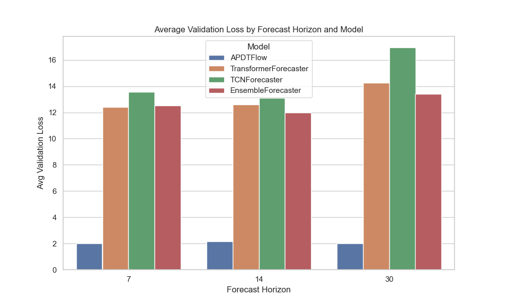
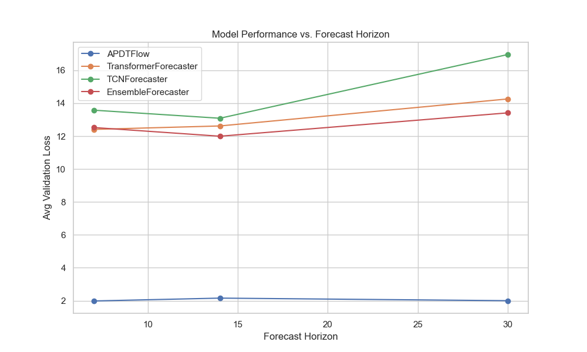
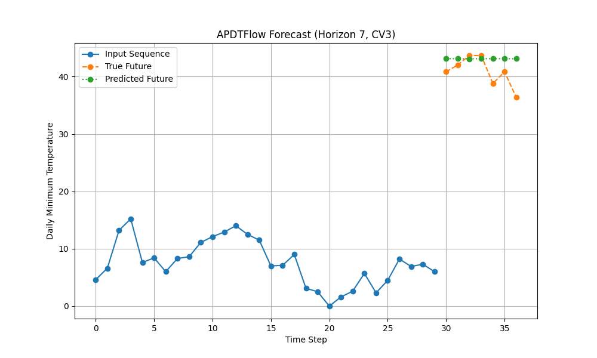

# APDTFlow: A Modular Forecasting Framework for Time Series Data
<p align="center">
  
</p>

[](https://pypi.org/project/apdtflow)
[](LICENSE)
[](https://pepy.tech/project/apdtflow)
[](https://pypi.org/project/apdtflow/)
[](https://github.com/yotambraun/APDTFlow/actions/workflows/ci.yml)
[](https://codecov.io/gh/yotambraun/APDTFlow)


APDTFlow is a modern and extensible forecasting framework for time series data that leverages advanced techniques including neural ordinary differential equations (Neural ODEs), transformer-based components, and probabilistic modeling. Its modular design allows researchers and practitioners to experiment with multiple forecasting models and easily extend the framework for new methods.

## 🚀 New in v0.2.0: Advanced Features!

APDTFlow v0.2.0 introduces **cutting-edge forecasting capabilities** based on 2025 research:

### 🌟 Exogenous Variables Support
**Boost accuracy by 30-50%** with external features:

```python
from apdtflow import APDTFlowForecaster

# Use external features like temperature, holidays, promotions
model = APDTFlowForecaster(
    forecast_horizon=14,
    exog_fusion_type='gated'  # 3 fusion strategies available
)

model.fit(
    df,
    target_col='sales',
    date_col='date',
    exog_cols=['temperature', 'is_holiday', 'promotion'],
    future_exog_cols=['is_holiday', 'promotion']  # Known in advance
)

# Predict with future exogenous data
future_exog = pd.DataFrame({'is_holiday': [0, 1, ...], 'promotion': [1, 0, ...]})
predictions = model.predict(exog_future=future_exog)
```

### 📊 Conformal Prediction
**Rigorous uncertainty quantification** with coverage guarantees:

```python
model = APDTFlowForecaster(
    forecast_horizon=14,
    use_conformal=True,  # Enable conformal prediction
    conformal_method='adaptive'  # Adapts to changing data
)

model.fit(df, target_col='sales')

# Get calibrated 95% prediction intervals
lower, pred, upper = model.predict(
    alpha=0.05,  # 95% coverage guarantee
    return_intervals='conformal'
)
```

### ⚡ Simple & Powerful API
**5 lines to production-ready forecasts:**

```python
from apdtflow import APDTFlowForecaster

model = APDTFlowForecaster(forecast_horizon=14)
model.fit(df, target_col='sales', date_col='date')
predictions = model.predict()
```

### Why APDTFlow?

| Feature | APDTFlow v0.2.0 | Other Libraries |
|---------|----------|-----------------|
| **Neural ODEs** | ✅ Continuous-time modeling | ❌ Discrete-time only |
| **Exogenous Variables** | ✅ 3 fusion strategies | ⚠️ Limited |
| **Conformal Prediction** | ✅ Rigorous uncertainty | ❌ Not available |
| **Multi-Scale Decomposition** | ✅ Trends + seasonality | ⚠️ Limited |
| **Simple `fit()/predict()` API** | ✅ 5 lines of code | ⚠️ Varies |
| **Multiple Architectures** | ✅ ODE/Transformer/TCN/Ensemble | ⚠️ Usually one |
| **PyTorch-based** | ✅ GPU acceleration | ✅ Most |


## Experiment Results
In our mega experiment we compared multiple forecasting models across different forecast horizons using 3-fold cross‑validation. For brevity, below we show two key plots:

1. **Validation Loss Comparison:** A bar plot comparing the average validation losses of the models (APDTFlow, TransformerForecaster, TCNForecaster, and EnsembleForecaster) across forecast horizons.
2. **Example Forecast (Horizon 7, CV Split 3):** A forecast plot for the APDTFlow model for a 7-step forecast from CV split 3.

## Validation Loss Comparison

The bar plot below summarizes the average validation losses (lower is better) for the different models across the forecast horizons (7, 10, and 30 time steps):



**Explanation:**  
This plot shows that the APDTFlow model (and possibly the ensemble) generally achieved lower validation losses compared to the other models, especially for longer forecast horizons. This indicates that its multi-scale decomposition and neural ODE dynamics are well-suited for capturing the trends and seasonal patterns in the dataset.

**Discussion:**  
The plot demonstrates that, overall, the APDTFlow model (and, in some cases, the ensemble) tend to achieve lower validation losses—particularly as the forecast horizon increases.

## Performance vs. Forecast Horizon

The following line plot illustrates how the performance (average validation loss) of each model changes with different forecast horizons. This visualization helps to assess which models maintain consistent performance as the forecast horizon increases.



**Discussion:**  
The line plot reveals the trend in model performance across forecast horizons. It helps us understand which models degrade gracefully (or even improve) as the forecast horizon lengthens.

## Example Forecast (Horizon 7, CV Split 3)

Below is an example forecast produced by the APDTFlow model for a forecast horizon of 7 time steps on the third cross-validation split.



**Discussion:** 
- **Input Sequence (Blue):** The historical data (last 30 time steps) used as input.
- **True Future (Dashed Orange):** The actual future values for the next 7 time steps.
- **Predicted Future (Dotted Line):** The forecast generated by the model.

---

*For a detailed explanation, more plots, and **additional analysis of these results**, please see our [Experiment Results and Analysis](docs/experiment_results.md) document.*


## Table of Contents

1. [Installation](#installation)
2. [Quick Start](#quick-start)
   - [Training](#training)
   - [Inference](#inference)
3. [Data Processing and Augmentation](#data-processing-and-augmentation)
4. [Forecasting Approaches](#forecasting-approaches)
   - [APDTFlow](#apdtflow)
   - [TransformerForecaster](#transformerforecaster)
   - [TCNForecaster](#tcnforecaster)
   - [EnsembleForecaster](#ensembleforecaster)
5. [Evaluation and Metrics](#evaluation-and-metrics)
6. [Command-Line Interface (CLI)](#command-line-interface-cli)
7. [Cross-Validation Strategies](#cross-validation-strategies)
8. [Documentation and Examples](#documentation-and-examples)
9. [License](#license)

## 1. Installation

APDTFlow is published on [PyPI](https://pypi.org/project/apdtflow). To install:

```bash
pip install apdtflow
```
For development, clone the repository and install in editable mode:

```bash
git clone https://github.com/yotambraun/APDTFlow.git
cd APDTFlow
pip install -e .
```
## ✨ New Features in v0.1.24

### 🚀 Easy-to-Use High-Level API (MAJOR UPDATE!)
- **Simple `fit()`/`predict()` interface** - No more complex DataLoaders or manual preprocessing
- **Works directly with pandas DataFrames** - Natural integration with your workflow
- **Automatic normalization and preprocessing** - Just pass your data and go
- **Built-in visualization** - `plot_forecast()` with uncertainty bands
- **Multiple model types in one API** - Switch between ODE/Transformer/TCN/Ensemble with one parameter

### 📈 Enhanced Package Discoverability
- **Comprehensive PyPI keywords** - Better search visibility for time-series, forecasting, neural-ode, etc.
- **Improved classifiers** - Clearer package categorization
- **CHANGELOG.md** - Track all improvements and updates

### Previous Features (v0.1.23)

- **Learnable Time Series Embedding:**
  APDTFlow includes a `TimeSeriesEmbedding` module that learns to encode temporal information using gated residual networks. This module processes both raw time indices and periodic signals (and optionally calendar features) to produce a rich embedding that improves the subsequent forecasting performance.

- **Configuration Options:**
  In `apdtflow/config/config.yaml`, you can specify:
  - `use_embedding`: Set to `true` to enable the new embedding.
  - `embed_dim`: The embedding dimension (recommended to match `hidden_dim`).

## 2. Quick Start

### Simple API (Recommended for Most Users)

The easiest way to get started with APDTFlow:

```python
import pandas as pd
from apdtflow import APDTFlowForecaster

# Load your time series data
df = pd.read_csv("dataset_examples/Electric_Production.csv", parse_dates=['DATE'])

# Create and train the forecaster
model = APDTFlowForecaster(
    forecast_horizon=14,     # Predict 14 steps ahead
    history_length=30,       # Use 30 historical points
    num_epochs=50           # Training epochs
)

# Fit the model (handles preprocessing automatically)
model.fit(df, target_col='IPG2211A2N', date_col='DATE')

# Make predictions with uncertainty estimates
predictions, uncertainty = model.predict(return_uncertainty=True)

# Visualize the forecast
model.plot_forecast(with_history=100, show_uncertainty=True)
```

**Try different models** by changing `model_type`:
```python
# Use Transformer instead of Neural ODE
model = APDTFlowForecaster(model_type='transformer', forecast_horizon=14)

# Or try Temporal Convolutional Network
model = APDTFlowForecaster(model_type='tcn', forecast_horizon=14)

# Or use Ensemble for maximum robustness
model = APDTFlowForecaster(model_type='ensemble', forecast_horizon=14)
```

### Advanced API (For Custom Workflows)

For advanced users who need more control:

```python
import torch
from torch.utils.data import DataLoader
from apdtflow.data import TimeSeriesWindowDataset
from apdtflow.models.apdtflow import APDTFlow

csv_file = "dataset_examples/Electric_Production.csv"
dataset = TimeSeriesWindowDataset(csv_file, date_col="DATE", value_col="IPG2211A2N", T_in=12, T_out=3)
train_loader = DataLoader(dataset, batch_size=16, shuffle=True)

model = APDTFlow(
    num_scales=3,
    input_channels=1,
    filter_size=5,
    hidden_dim=16,
    output_dim=1,
    forecast_horizon=3,
    use_embedding=True
)
device = torch.device("cuda" if torch.cuda.is_available() else "cpu")
model.to(device)

model.train_model(
    train_loader=train_loader,
    num_epochs=15,
    learning_rate=0.001,
    device=device
)
```

### Inference
Use the following example to run inference on new data:

```python
import torch
from torch.utils.data import DataLoader
from apdtflow.data import TimeSeriesWindowDataset
from apdtflow.models.apdtflow import APDTFlow

test_dataset = TimeSeriesWindowDataset(
    csv_file="path/to/dataset.csv",
    date_col="DATE",
    value_col="VALUE",
    T_in=12,
    T_out=3
)
test_loader = DataLoader(test_dataset, batch_size=16, shuffle=False)

model = APDTFlow(
    num_scales=3,
    input_channels=1,
    filter_size=5,
    hidden_dim=16,
    output_dim=1,
    forecast_horizon=3,
    use_embedding=True
)
device = torch.device("cuda" if torch.cuda.is_available() else "cpu")
model.to(device)

checkpoint_path = "path/to/checkpoint.pt"
model.load_state_dict(torch.load(checkpoint_path, map_location=device))

metrics = model.evaluate(test_loader, device, metrics=["MSE", "MAE", "RMSE", "MAPE"])
print("Evaluation Metrics:", metrics)
```

## 3. Data Processing and Augmentation
APDTFlow provides robust functions to process and augment your time series data. Key features include:
* **Date Conversion:** Automatically converts date columns to **datetime** objects.
* **Gap Filling:** Reindexes data to ensure a consistent time frequency.
* **Missing Value Imputation:** Supports methods such as forward-fill, backward-fill, mean substitution, and interpolation.
* **Feature Engineering:** Generates lag features and rolling statistics to enhance predictive performance.
* **Data Augmentation:** Offers techniques like jittering, scaling, and time warping to improve model robustness.

---

## 4. Forecasting Approaches
APDTFlow includes several advanced forecasting strategies:

### APDTFlow
The **APDTFlow** model integrates:
- **Multi-Scale Decomposition:** Decomposes the input signal into multiple resolutions.
- **Neural ODE Dynamics:** Models continuous latent state evolution using Neural ODEs.
- **Probabilistic Fusion:** Merges latent representations while quantifying uncertainty.
- **Transformer-Based Decoding:** Generates forecasts using a time-aware attention mechanism.
Key parameters include **T_in**, **T_out**, **num_scales**, **filter_size**, **hidden_dim**, and **forecast_horizon**.

### TransformerForecaster
Leverages the Transformer architecture to capture long-range dependencies using self‑attention. This approach is ideal for complex temporal patterns where context from many time steps is relevant.

### TCNForecaster
Based on Temporal Convolutional Networks, the TCNForecaster uses dilated convolutions and residual connections to efficiently capture local and medium-range dependencies.

### EnsembleForecaster
Combines predictions from multiple forecasting models (such as APDTFlow, TransformerForecaster, and TCNForecaster) using aggregation strategies (e.g., weighted averaging) to improve overall forecast robustness and accuracy.

#### Core Model Parameters Explained:
For a comprehensive description of each model's architecture and additional details, please see the [Model Architectures Documentation](docs/models.md).
When configuring APDTFlow, several parameters play key roles in how the model processes and forecasts time series data. Here’s what they mean:

* **T_in (Input Sequence Length):** This parameter specifies the number of past time steps the model will use as input. For example, if T_in=12, the model will use the previous 12 observations to make a forecast.
* **T_out (Forecast Horizon):** This parameter defines the number of future time steps to predict. For instance, if T_out=3, the model will output predictions for the next 3 time steps.
* **num_scales:** APDTFlow employs a multi-scale decomposition technique to capture both global and local trends in the data. The num_scales parameter determines how many scales (or resolutions) the input signal will be decomposed into. A higher number of scales may allow the model to capture more complex temporal patterns, but it could also increase computational complexity.
* **filter_size:** This parameter is used in the convolutional component (or dynamic convolution) within the model’s decomposer module. It defines the size of the convolutional filter applied to the input signal, thereby affecting the receptive field. A larger filter size allows the model to consider a broader context in the time series but may smooth out finer details.
* **forecast_horizon:** This parameter is used within the model to indicate the number of future time steps that the decoder will produce. It should match T_out to ensure consistency between the training data and the model's output.
* **hidden_dim:** The size of the hidden state in the dynamics module and decoder. This parameter controls the capacity of the model to learn complex representations. Increasing hidden_dim may improve the model’s performance, but at the cost of additional computational resources and potential overfitting if not tuned properly.

---

## 5. Evaluation and Metrics
APDTFlow incorporates a flexible evaluation framework that supports several performance metrics including:
- **Mean Squared Error (MSE)**
- **Mean Absolute Error (MAE)**
- **Root Mean Squared Error (RMSE)**
- **Mean Absolute Percentage Error (MAPE)**

These metrics are computed via a dedicated evaluator, which can be extended with additional metrics as needed.
**Usage Example:**
```python
from apdtflow.evaluation.regression_evaluator import RegressionEvaluator

evaluator = RegressionEvaluator(metrics=["MSE", "MAE", "RMSE", "MAPE"])
results = evaluator.evaluate(predictions, targets)
print("MSE:", results["MSE"], "MAE:", results["MAE"], "RMSE:", results["RMSE"], "MAPE:", results["MAPE"])
```

---

## 6. Command-Line Interface (CLI)
For ease of use, APDTFlow provides a command‑line interface that allows you to run training, evaluation, and inference directly from the terminal. The CLI accepts various parameters to configure the forecasting process without modifying the code.
#### Available Commands:
- **apdtflow train:** – Train a forecasting model.
- **apdtflow infer:** – Run inference using a saved checkpoint.

#### Example Usage:
```bash
# Train a model (using the learnable embedding, which is enabled by default)
apdtflow train --csv_file path/to/dataset.csv --date_col DATE --value_col VALUE --T_in 12 --T_out 3 --num_scales 3 --filter_size 5 --hidden_dim 16 --batch_size 16 --learning_rate 0.001 --num_epochs 15 --checkpoint_dir ./checkpoints

# Alternatively, disable the learnable embedding by adding the flag:
apdtflow train --csv_file path/to/dataset.csv --date_col DATE --value_col VALUE --T_in 12 --T_out 3 --num_scales 3 --filter_size 5 --hidden_dim 16 --batch_size 16 --learning_rate 0.001 --num_epochs 15 --checkpoint_dir ./checkpoints --no_embedding

# Run inference (ensure that the embedding setting matches what was used during training)
apdtflow infer --csv_file path/to/dataset.csv --date_col DATE --value_col VALUE --T_in 12 --T_out 3 --checkpoint_path ./checkpoints/APDTFlow_checkpoint.pt --batch_size 16
```

---

## 7. Cross-Validation Strategies
To ensure robust forecasting evaluation, APDTFlow includes a Cross-Validation Factory that supports:
- **Rolling Splits:** Moving training and validation windows over time.
- **Expanding Splits:** Increasing training window size while keeping validation size constant.
- **Blocked Splits:** Dividing the dataset into contiguous blocks.

#### Usage Example:
```python
from apdtflow.cv_factory import TimeSeriesCVFactory
from torch.utils.data import Dataset

class SampleDataset(Dataset):
    def __init__(self, length=100):
        self.data = list(range(length))
    def __len__(self):
        return len(self.data)
    def __getitem__(self, idx):
        return self.data[idx]

dataset = SampleDataset()
cv_factory = TimeSeriesCVFactory(dataset, method="rolling", train_size=40, val_size=10, step_size=10)
splits = cv_factory.get_splits()
print("Cross-Validation Splits:", splits)
```

---

## 8. Documentation and Examples
For comprehensive documentation—including user guides, API references, and example notebooks—please visit the docs directory. The examples provide step-by-step instructions for data preprocessing, model training, evaluation, and inference.

[APDTFlow Documentation](https://github.com/yotambraun/APDTFlow/blob/main/docs/index.md)

[Model Architectures Documentation](https://github.com/yotambraun/APDTFlow/blob/main/docs/models.md)

[Experiment Results and Analysis](https://github.com/yotambraun/APDTFlow/blob/main/docs/experiment_results.md)

[Configuration and YAML Files](https://github.com/yotambraun/APDTFlow/blob/main/apdtflow/config/config.yaml)

---

## 9. License
APDTFlow is licensed under the MIT License. For more details, please refer to the [LICENSE](LICENSE) file.
