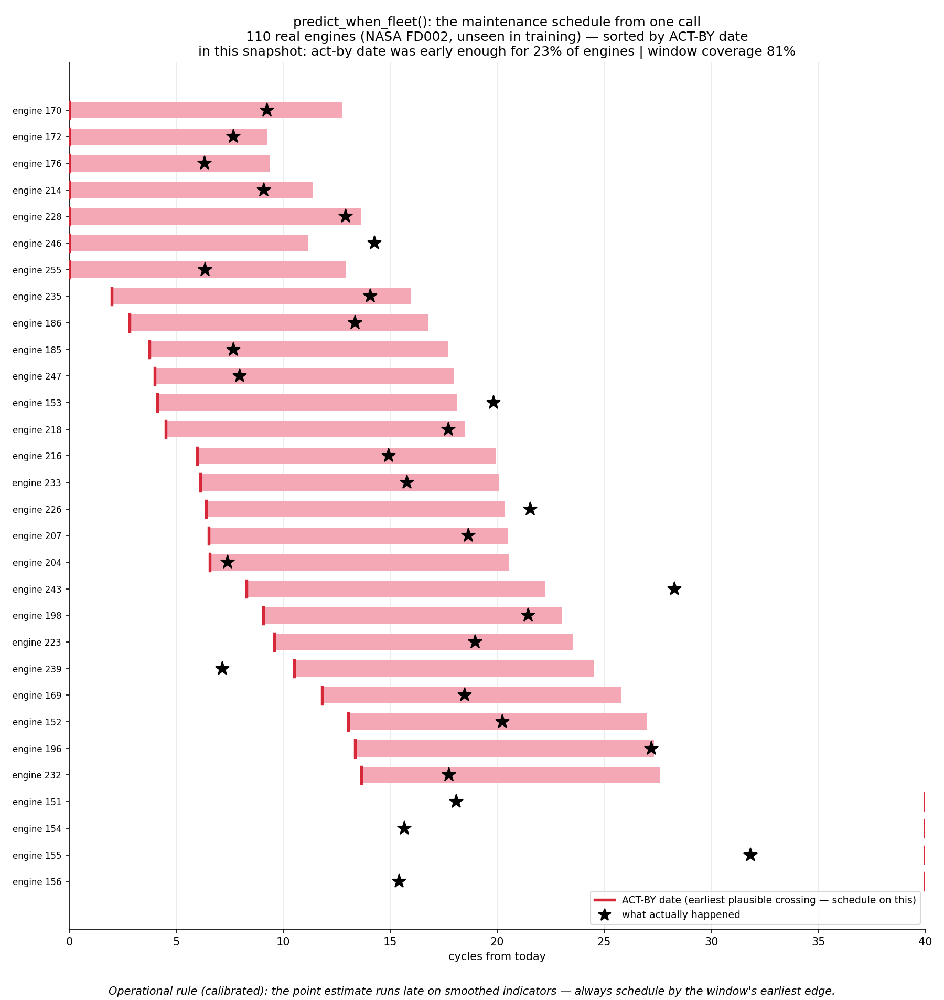
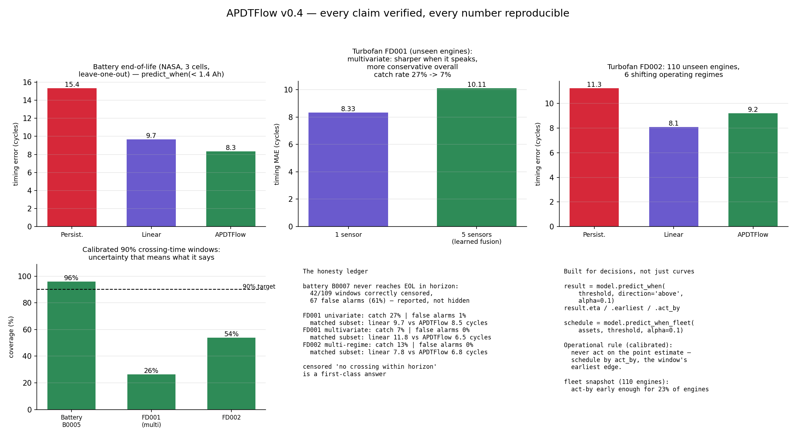
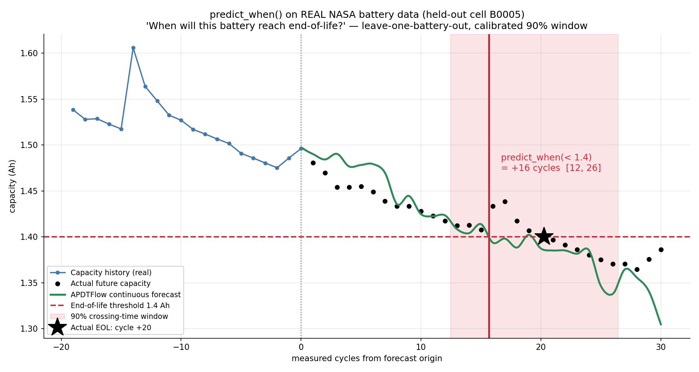
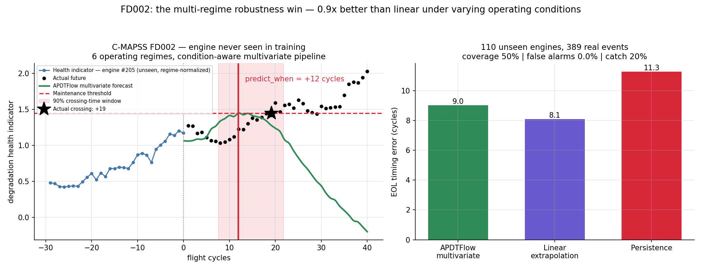
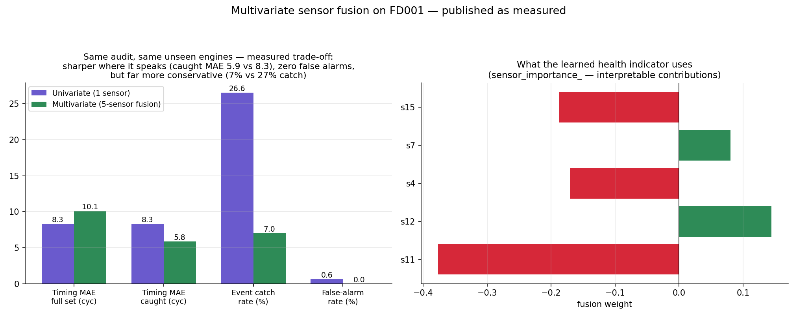
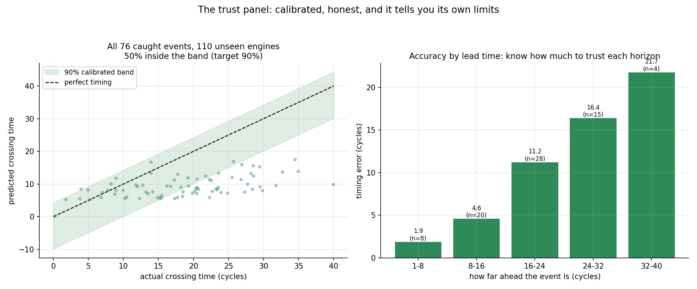
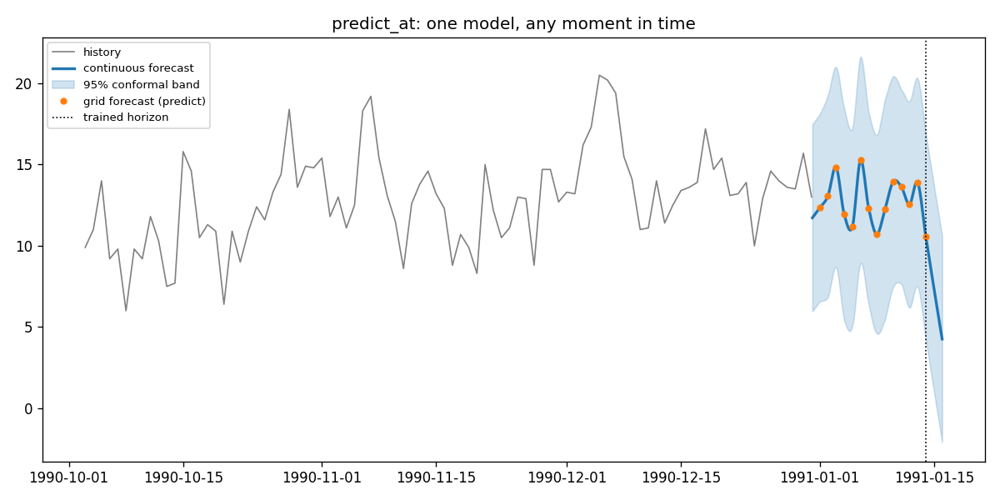
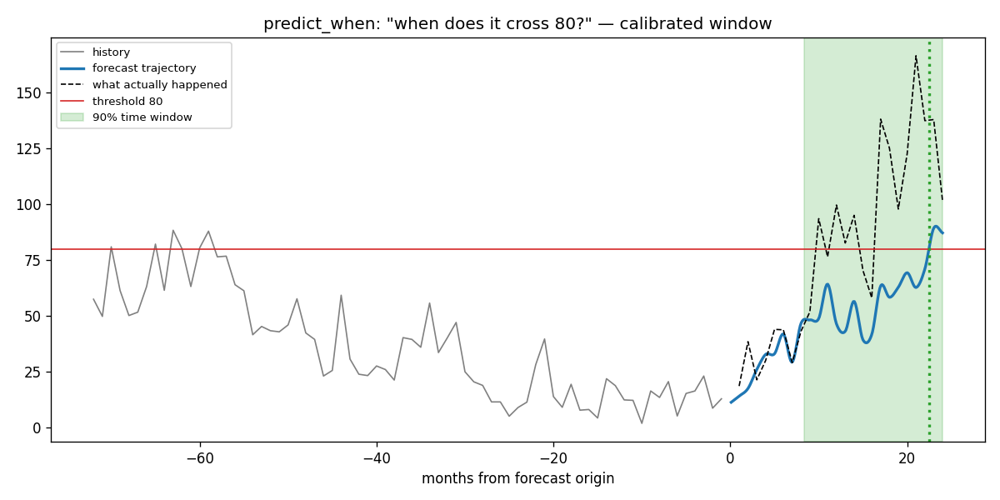

<p align="center">
  
</p>

# APDTFlow — know WHEN it will happen

[](https://pypi.org/project/apdtflow)
[](LICENSE)
[](https://pepy.tech/project/apdtflow)
[](https://pypi.org/project/apdtflow/)
[](https://github.com/yotambraun/APDTFlow/actions/workflows/ci.yml)
[](https://codecov.io/gh/yotambraun/APDTFlow)
[](https://colab.research.google.com/github/yotambraun/APDTFlow/blob/main/Quickstart.ipynb)

**[Quickstart](Quickstart.ipynb)** ·
**[Documentation](docs/index.md)** ·
**[Methodology](docs/METHODOLOGY.md)** ·
**[Benchmarks](docs/experiment_results.md)** ·
**[Examples](examples/)**

Forecasting tools tell you *what the value will be*. APDTFlow models time as **continuous**
(Neural ODEs), so it also answers the question operations teams actually ask: **when will
it cross the line?** — with a calibrated uncertainty window on the time itself.

One trained model answers three questions:

| Question | API |
|---|---|
| What are the next k values? | `model.predict()` |
| What is the value at **any** moment — 14:37, in 3.6 days, beyond the trained horizon? | `model.predict_at(timestamps)` |
| **When** will the value cross a threshold — with uncertainty on the time itself? | `model.predict_when(threshold)` |



*One call — `predict_when_fleet()` — turns real NASA jet engines (never seen in
training) into a maintenance schedule sorted by act-by date, with what actually
happened marked. In this measured snapshot the calibrated windows covered 81% of
the actual crossings.*

## 60-second start

    pip install apdtflow

```python
from apdtflow import APDTFlowForecaster

model = APDTFlowForecaster(forecast_horizon=40, decoder_type='continuous',
                           use_conformal=True)
model.fit(df, target_col='capacity', feature_cols=sensor_cols)

model.predict()                                       # classic grid forecast
model.predict_at(['2026-06-11 14:37', 3.6])           # value at ANY moment
result = model.predict_when(threshold=1.4,            # WHEN it crosses the line
                            direction='below')
result.eta, result.act_by, result.censored
schedule = model.predict_when_fleet(assets,           # whole fleet -> ranked schedule
                                    threshold=1.4, direction='below')
```

## Verified results (every number reproducible from `experiments/`)



| Event-timing audit (real NASA data, held-out units) | APDTFlow | Linear extrap. | Persistence |
|---|---|---|---|
| Battery end-of-life, 3 cells leave-one-battery-out (timing MAE, measured cycles) | **8.3** (2.8 on the typical cell) | 9.7 | 15.4 |
| Turbofan FD001, 40 unseen engines (timing MAE, cycles; 0.6% false alarms) | **8.3** | 8.7 | 11.5 |
| Turbofan FD002, 110 unseen engines, 6 operating regimes (timing MAE, cycles; 0.0% false alarms) | 9.2 | **8.1** | 11.3 |

APDTFlow wins the battery and FD001 audits outright and **loses to linear on
FD002** — published as measured (it does win FD002's matched subset, 6.8 vs 7.8
cycles, and posts **zero false alarms across 2,638 no-crossing windows**, the
property that matters most against alarm fatigue). Time-window coverage measured
96% / 40% / 54% against a 90% target across the three audits: strong
within-distribution, stretched by cross-unit transfer — the trust panel below
shows exactly that.

Reproduce: `python experiments/battery_eol_demo.py`, `experiments/turbofan_when_demo.py`,
`experiments/fd002_robustness_demo.py`. Full details: [docs/experiment_results.md](docs/experiment_results.md).

### Real-world demo: battery end-of-life



### Real-world demo: jet-engine maintenance under shifting operating regimes



Multivariate sensor fusion (`fit(..., feature_cols=sensors)`) exposes
interpretable sensor weights via `model.sensor_importance_`, and — measured on the
same audit — trades coverage for sharpness: when the fused model commits to a
timing it is markedly more accurate (caught-event error 5.9 vs 8.3 cycles, zero
false alarms), but it commits far less often. Published as measured:



## Trust panel — this package tells you its own limits



The panel reports its own miss: on cross-unit transfer the windows measured
under their 90% target, and for distant events the point estimate saturates
toward mid-horizon (the flattening scatter). That is why the **operational rule**
exists: **schedule by `act_by` (the window's earliest edge), never by the point
estimate** — the API returns `act_by` as a first-class field for exactly this
reason, and the per-lead-time error bars tell you how much to trust each horizon.

## predict_at — forecast at any moment in time



One trained model, queried at arbitrary real-valued timestamps — fractional steps,
between observations, even beyond the trained horizon — because the decoder
integrates a continuous-time ODE. Conformal intervals come interpolated across
time. (`python examples/predict_at_demo.py` produced this plot.)

## predict_when — a calibrated answer to "when?"



*"When will solar activity rise above 80?" — the calibrated 90% window covered the
true crossing, and the `act_by` edge landed before it. Windows are calibrated on
crossing-time errors (time space), not value bands — the distinction that makes
the coverage hold.* (`python examples/predict_when_demo.py`.)

## Is the base forecaster accurate? Honest numbers

6 datasets (2 real, 4 synthetic), 12-step horizon, 30 epochs, MAE relative to
seasonal-naive (<1.0 beats it). Measured June 2026; reproduce:
`python experiments/benchmark_multidomain.py`.

| Dataset | APDTFlow | Linear | Holt-Winters |
|---|---|---|---|
| Daily min temperature (real) | **0.73** | 0.74 | 0.80 |
| Regime-switching nonlinear | **0.77** | 0.83 | 0.86 |
| Trend + dual seasonality | 0.85 | 0.50 | **0.38** |
| Retail-like multiplicative seasonal | 1.01 | **0.68** | 0.81 |
| Electric production (real, 397 pts) | 1.52 | **1.03** | 1.23 |
| Random walk (unpredictable) | 1.86 | 1.15 | 1.12 |

APDTFlow beats seasonal-naive on 3 of 6 domains (parity on a 4th) and beats every
baseline on two. For pure grid accuracy on regular data, tuned deep models
(NeuralForecast) or zero-shot foundation models (Chronos-2, TimesFM, Moirai-2)
may be stronger — APDTFlow's value is what grid models cannot do. We are not
aware of another forecasting library offering `predict_at` at arbitrary
timestamps or calibrated `predict_when` event timing (as of June 2026); if you
use a foundation model for grid accuracy, APDTFlow is complementary.

### What each tool family offers (capabilities, not accuracy)

| Capability | APDTFlow | Grid DL libraries (NeuralForecast, Darts) | Foundation models (Chronos-2, TimesFM, Moirai-2) |
|---|:-:|:-:|:-:|
| Grid forecasts (`predict`) | ✅ | ✅ | ✅ |
| Calibrated conformal intervals | ✅ | partial | partial |
| Forecast at arbitrary real-valued times (`predict_at`) | ✅ | — | — |
| Event timing with calibrated time windows (`predict_when`) | ✅ | — | — |
| Fleet-level act-by scheduling | ✅ | — | — |
| Zero-shot (no training) | — | — | ✅ |

## When NOT to use APDTFlow

- Stock prices / crypto — random-walk regime; nothing beats naive, including us
  (it's in our benchmark table on purpose).
- Event timing on noise-driven crossings (e.g., which exact day a noisy daily
  series first dips) — no model has skill there; expect wide, honest windows.
- Irregularly-sampled / heavily missing data — we tested ODE-RNN encoders and
  missingness features; both lost to simple imputation baselines
  ([documented](docs/METHODOLOGY.md)).
- Very short series (< ~500 points) — use ETS/ARIMA.

## Industry-grade plumbing

- Split & adaptive **conformal prediction** on every API; time-space calibrated
  windows for event timing
- **Multivariate** health-indicator fusion (`feature_cols=`) with readable
  `sensor_importance_`; per-regime normalization
  (`apdtflow.preprocessing.regime_normalize`) for multi-condition equipment
- **Fleet API**: `predict_when_fleet()` → act-by-sorted schedule, CSV/dict export
- Exogenous & categorical features, backtesting (`historical_forecasts`),
  MASE/sMAPE/CRPS/coverage metrics
- Robust persistence (`save`/`load` with scalers + calibration; pre-0.4
  checkpoints are rejected with guidance), TorchScript export, FastAPI serving
  example, sklearn-style `get_params`/`set_params`, `score_recent()` drift hook,
  `set_seed()` deterministic mode, MLflow/W&B logging hook, `py.typed`
- Architectures: Neural ODE (default), Transformer, TCN, Ensemble

## Versioning

Pre-1.0 we follow SemVer pragmatically: breaking changes land only in minor
releases, are flagged in [CHANGELOG.md](CHANGELOG.md), and deprecated aliases
are kept for one minor release. **All checkpoints from versions ≤ 0.3.x are
invalid** — those versions contained a defect that made predictions independent
of the input data; see the engineering history in
[docs/METHODOLOGY.md](docs/METHODOLOGY.md).

## Have degradation or depletion data?

Run the audit yourself: `python experiments/audit_predict_when.py` benchmarks
`predict_when` against persistence, linear extrapolation, and seasonal baselines
on *your* data. If APDTFlow wins, open a PR — we feature your domain with your
numbers. That pipeline is how every result on this page was produced, including
the ideas we tested and **rejected** ([docs/METHODOLOGY.md](docs/METHODOLOGY.md)).

## Articles

- [A Practical Approach to Time Series Forecasting with APDTFlow](https://pub.towardsai.net/a-practical-approach-to-time-series-forecasting-with-apdtflow-78e06cb51a1b) — Towards AI
- [APDTFlow v0.3.0: From Research to Production-Ready Time Series Forecasting](https://medium.com/towards-artificial-intelligence/apdtflow-v0-3-0-from-research-to-production-ready-time-series-forecasting-0be1848e323a) — Towards AI

*Both articles cover earlier versions; the core ideas still apply, but the API has
grown since (`predict_at`, `predict_when`, fleet scheduling) and v0.4.0 fixed a
critical model defect — see the [CHANGELOG](CHANGELOG.md) before following old code
snippets.*

## Citation

If APDTFlow is useful in your research, please cite it:

```bibtex
@software{apdtflow,
  author = {Braun, Yotam},
  title  = {APDTFlow: continuous-time forecasting with Neural ODEs},
  url    = {https://github.com/yotambraun/APDTFlow},
  year   = {2026},
  version = {0.4.0}
}
```

## More

[Methodology & references](docs/METHODOLOGY.md) ·
[Benchmarks](docs/experiment_results.md) ·
[Model architectures](docs/models.md) ·
[Documentation](docs/index.md) ·
[Examples](examples/) ·
[Quickstart notebook](Quickstart.ipynb) ·
[Contributing](CONTRIBUTING.md)

## License

MIT
