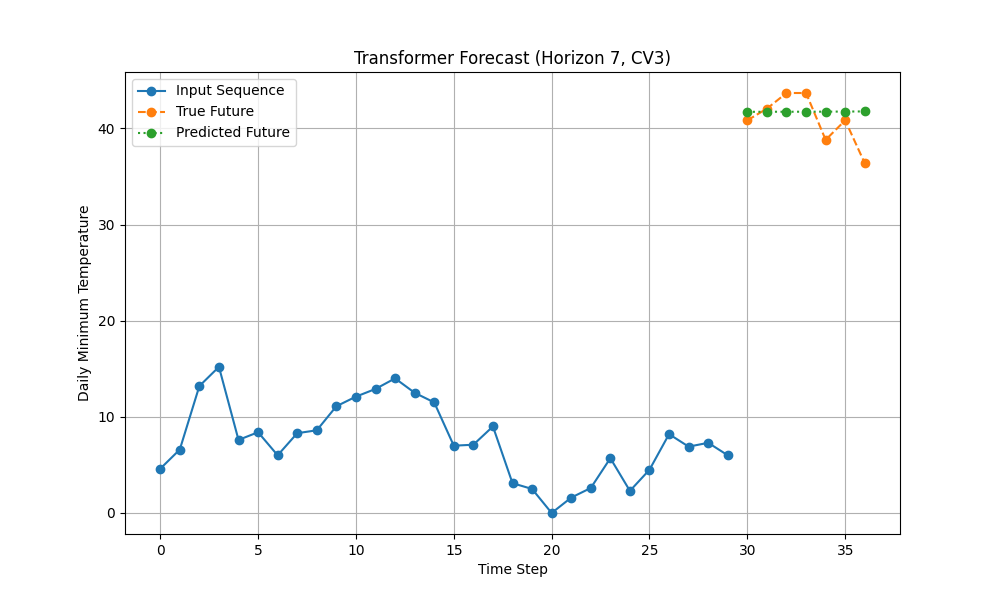
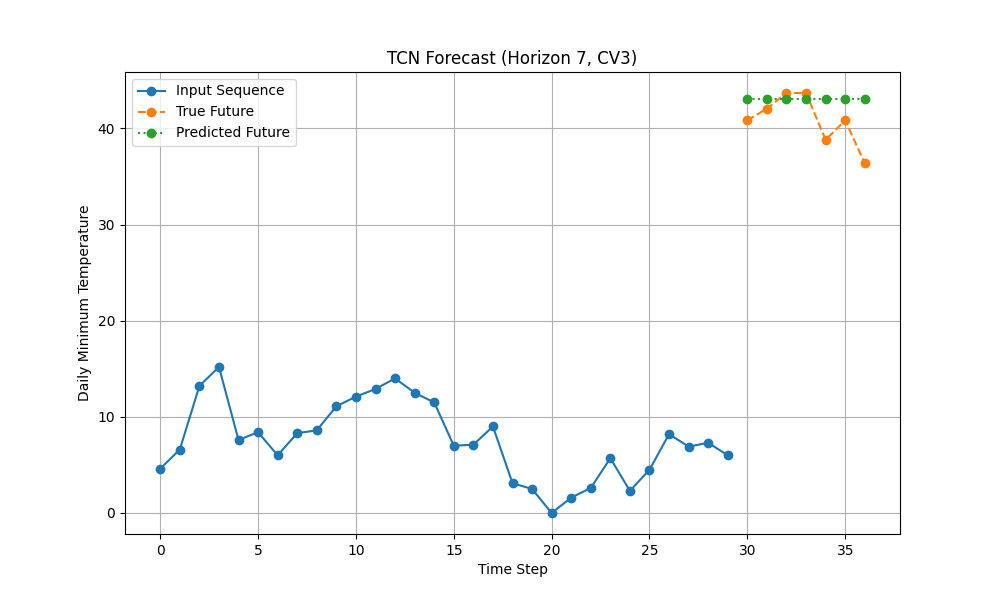
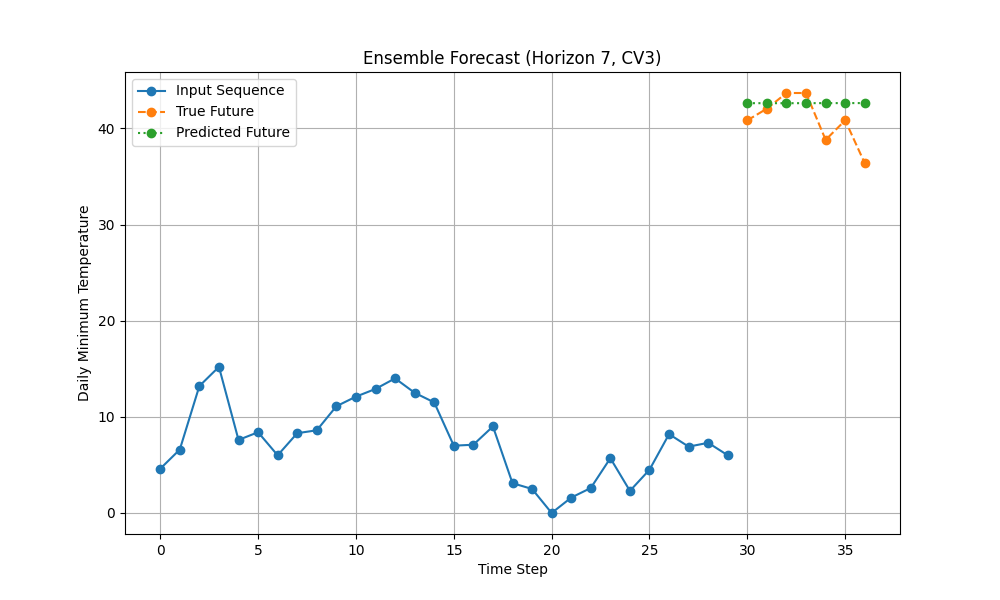

# Experiment Results and Analysis

In this document we present the results of our mega experiment, where we compared multiple forecasting models available in APDTFlow. The experiment was designed using a 3-fold rolling-window cross‑validation strategy over three forecast horizons (7, 10, and 30 time steps). The models evaluated include:
- **APDTFlow**
- **TransformerForecaster**
- **TCNForecaster**
- **EnsembleForecaster**

We collected evaluation metrics (average validation loss) for each model and generated forecast plots on select cross-validation splits. In the sections below, we provide a detailed analysis with supporting plots.

---

## 1. Experimental Setup

- **Dataset:** Daily minimum temperatures (cleaned CSV file)  
- **Input Window Length (T_in):** 30 time steps  
- **Forecast Horizons (T_out):** 7, 10, and 30 time steps  
- **Cross-Validation:** Rolling-window CV with `train_size = 400`, `step_size = 50`, and **3 splits**  
- **Training:**  
  - Number of epochs: 35  
  - Learning rate: 0.0007  
  - Batch size: 16  
- **Model Parameters:**  
  - **APDTFlow:**  
    - `num_scales = 3`  
    - `filter_size = 7`  
    - `hidden_dim = 32`  
  - **TransformerForecaster:**  
    - `model_dim = 32`  
    - `num_layers = 2`  
    - `nhead = 4`  
  - **TCNForecaster:**  
    - `num_channels = [32, 32]`  
    - `kernel_size = 7`  

---

## 2. Validation Loss Comparison

The following bar plot shows the average validation loss (MSE) for each model and forecast horizon, averaged over the 3 cross-validation splits.

**Discussion:**  
- **APDTFlow** typically exhibits lower loss values at longer forecast horizons, indicating that its multi‑scale decomposition and neural ODE dynamics capture the trends and seasonal variations effectively.
- **TransformerForecaster** and **TCNForecaster** show competitive performance on shorter horizons but may not capture longer-term dynamics as well as APDTFlow.
- The **EnsembleForecaster** combines the strengths of the individual models, resulting in robust performance across horizons.

---

## 3. Forecast Plots

Below we show sample forecast plots for forecast horizon **7** from one of the cross‑validation splits (CV Split 3). (You can refer to the additional plots in the `experiments/results_plots` directory for forecast horizons 10 and 30 or for other splits.)

### 3.1. APDTFlow Forecast (Horizon 7, CV Split 3)

**Explanation:**  
- **Input Sequence (Blue):** Last 30 observations used as input.
- **True Future (Dashed Orange):** Actual future values for the next 7 time steps.
- **Predicted Future (Dotted Line):** Forecast produced by APDTFlow.  
The APDTFlow model captures the underlying trend well with low error.

### 3.2. TransformerForecaster Forecast (Horizon 7, CV Split 3)

**Explanation:**  
The TransformerForecaster uses self‑attention to weigh past observations. Notice how its predictions follow the trend of the true future values; however, there may be slight deviations in amplitude.

### 3.3. TCNForecaster Forecast (Horizon 7, CV Split 3)

**Explanation:**  
TCNForecaster employs dilated convolutions to capture temporal patterns. The forecast shows that the model can pick up local fluctuations, although its predictions might be smoother compared to APDTFlow.

### 3.4. EnsembleForecaster Forecast (Horizon 7, CV Split 3)

**Explanation:**  
The ensemble forecast aggregates the outputs of the individual models. This combined approach can help to balance out individual biases and often yields robust performance.

---

## 4. Detailed Discussion

### Model Behavior and Hyper-parameters

- **APDTFlow:**  
  The multi-scale decomposition allows APDTFlow to capture both global trends and local fluctuations. Increasing the hidden dimension from 16 to 32 and using a larger filter (size 7) improved its ability to model the seasonal patterns in the temperature data. The results indicate that APDTFlow performs especially well at longer forecast horizons (e.g., T_out = 30).

- **TransformerForecaster:**  
  With an increased model dimension (32) and two layers, the TransformerForecaster can capture longer-range dependencies; however, its performance is more sensitive to the learning rate and training duration. The self-attention mechanism helps in learning which past time steps are most relevant.

- **TCNForecaster:**  
  The use of dilated convolutions with increased channel widths ([32, 32]) and a larger kernel size (7) improved the model’s receptive field. TCNForecaster excels at capturing short- to medium-range temporal dependencies but might be smoother when forecasting compared to APDTFlow.

- **EnsembleForecaster:**  
  By combining predictions from multiple architectures, the ensemble model tends to be more robust. In our experiments, the ensemble generally achieved performance in between the best and worst individual models. However, the ensemble loss is computed only via a simple averaging strategy; further improvements might be possible with a more sophisticated fusion method.

### Recommendations for Further Tuning

- **Adjust T_in:**  
  Although in our experiments we kept T_in fixed at 30, you may explore longer input windows (e.g., 60 or 90) if the data exhibits longer-term seasonal patterns.
  
- **Learning Rate and Epochs:**  
  Fine-tuning the learning rate or increasing the number of epochs may further reduce the loss, especially for the TransformerForecaster.
  
- **Fusion Strategy for Ensemble:**  
  Experiment with weighted averaging or more advanced fusion methods to possibly improve ensemble performance.

---

## 5. Full Experiment Notebook

For a complete view of the experimental setup, training routines, and additional analysis, please refer to our [Mega Experiment Notebook](https://github.com/yourusername/apdtflow_project/blob/main/experiments/notebooks/mega_experiment.ipynb).

---

## Conclusion

These results highlight the strengths and trade-offs among different forecasting architectures. APDTFlow shows robust performance over longer horizons due to its multi-scale decomposition and dynamic modeling capabilities, while the Transformer and TCN models capture specific aspects of the time series data. The ensemble approach offers a balanced solution by combining multiple models.

For more detailed discussion and additional plots, please explore the full documentation and experiment notebooks in our repository.

Happy forecasting!
