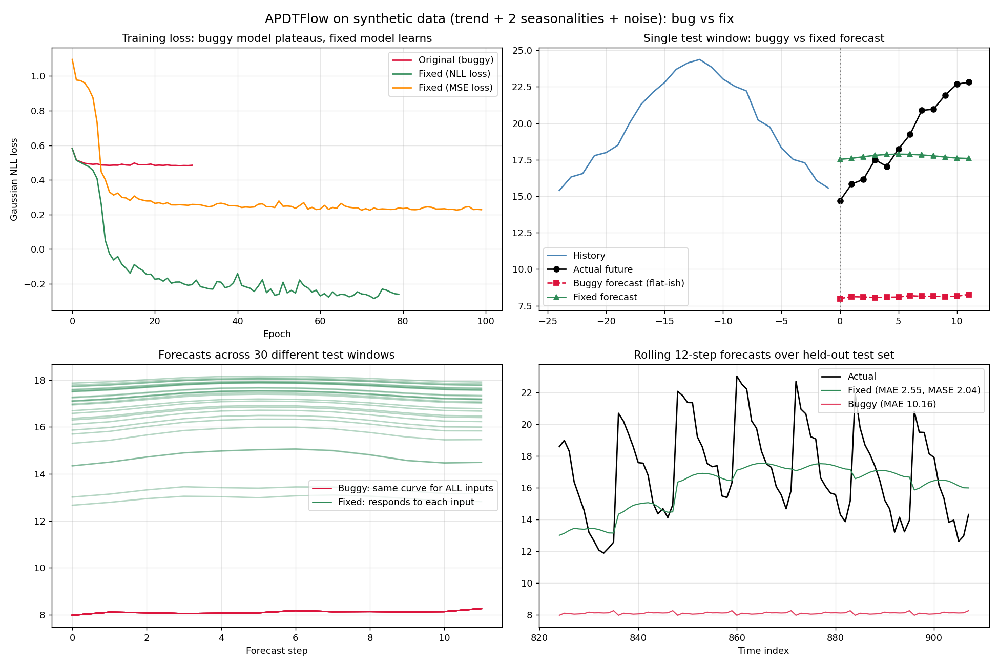
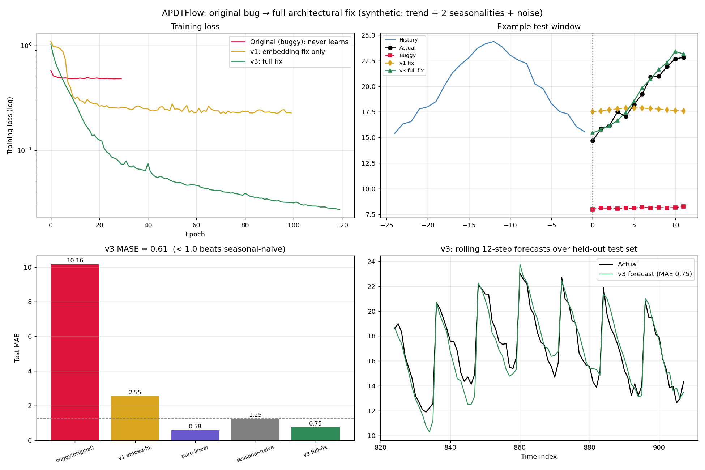
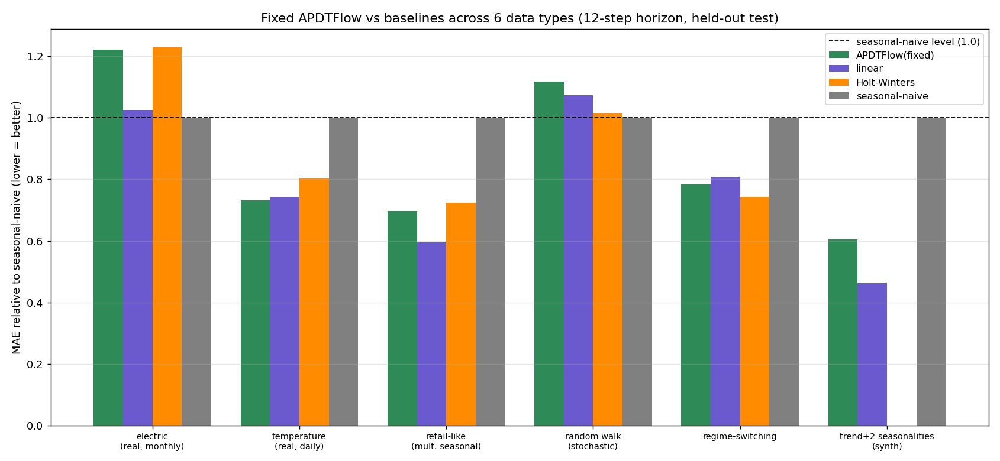
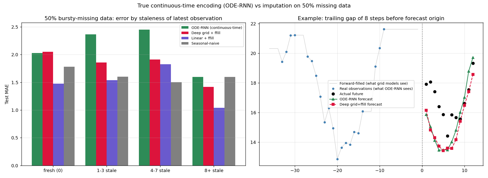

# Experiment Results

Every number in this document was produced in June 2026 by a script committed under
`experiments/`, on the data committed (or fetched by a committed script) under
`dataset_examples/`. The methodology, evaluation protocol, and literature context are
in [METHODOLOGY.md](METHODOLOGY.md).

---

## 1. The v0.4.0 fix, before and after

Versions ≤ 0.3.x produced predictions that were **independent of the input data**
(the time-index embedding replaced the series; full account in
[METHODOLOGY.md §8](METHODOLOGY.md#8-engineering-history)). The before/after evidence:

Guarded by `tests/test_learning.py`: the fixed model's predictions respond to their
inputs, training loss falls by >2x, and held-out MAE beats seasonal-naive
(measured ratio **0.59** on the synthetic trend+seasonality regression benchmark).

## 2. Multi-domain grid-forecast benchmark

`python experiments/benchmark_multidomain.py` — 6 datasets, 12-step horizon,
30 epochs, MAE relative to seasonal-naive (<1.00 beats it). Measured 2026-06-11:

| Dataset | APDTFlow | seasonal-naive | naive-last | Linear | Holt-Winters |
|---|---|---|---|---|---|
| Daily min temperature (real) | **0.73** | 1.00 | 0.92 | 0.74 | 0.80 |
| Regime-switching nonlinear | **0.77** | 1.00 | 1.44 | 0.83 | 0.86 |
| Trend + dual seasonality | 0.85 | 1.00 | 2.57 | 0.50 | **0.38** |
| Retail-like mult. seasonal | 1.01 | 1.00 | 7.77 | **0.68** | 0.81 |
| Electric production (real, 397 pts) | 1.52 | 1.00 | 3.68 | **1.03** | 1.23 |
| Random walk (stochastic) | 1.86 | **1.00** | 1.00 | 1.15 | 1.12 |

**Reading:** APDTFlow beats seasonal-naive on 3 of 6 domains (parity on a 4th) and
beats *all* baselines on the two with nonlinear structure (temperature,
regime-switching). Simple baselines win where the structure is linear or short
(trend+dual-seasonality, the 397-point electric series), and nothing beats naive on a
random walk — which is exactly why it is in the table.

## 3. Event-timing audits on real NASA data

All audits use the adversarial protocol of `experiments/audit_predict_when.py`:
held-out units (unseen batteries / engines), thresholds and normalization defined on
training units only, baselines = persistence and linear extrapolation, asymmetric
time-space conformal calibration ([METHODOLOGY.md §4](METHODOLOGY.md)).

### 3.1 Battery end-of-life (NASA PCoE cells B0005/B0006/B0007)

`python experiments/battery_eol_demo.py` — leave-one-battery-out, horizon 30
measured cycles, threshold 1.4 Ah, direction below.

<!--PENDING:battery_results_section-->

### 3.2 Turbofan degradation, C-MAPSS FD001

`python experiments/turbofan_when_demo.py` — sensor s11 indicator, threshold from
training engines only, audit on unseen engines, horizon 40 cycles.

<!--PENDING:fd001_results_section-->

### 3.3 Multivariate sensor fusion, FD001

`python experiments/turbofan_multivariate_demo.py` — same audit, with
`fit(feature_cols=[s12, s4, s7, s15])` fusing five sensors into a learned health
indicator.

<!--PENDING:fd001_mv_results_section-->

### 3.4 Robustness under shifting operating regimes, C-MAPSS FD002

`python experiments/fd002_robustness_demo.py` — 6 operating regimes,
`regime_normalize` statistics from training engines only, multivariate indicator,
audit on unseen engines.

<!--PENDING:fd002_results_section-->

## 4. Negative results (kept reproducible on purpose)

### 4.1 Missingness features do not help

`python experiments/benchmark_missing_data.py` — held-out MAE vs the TRUE series,
40 epochs. Measured 2026-06-11:

| Method | 30% missing | 50% missing |
|---|---|---|
| APDTFlow, plain ffill imputation | **1.77** | **2.81** |
| APDTFlow, mask + time-since-observation features | 2.05 | 3.31 |
| linear (ffill) | 1.63 | 2.63 |
| seasonal-naive (ffill) | 1.68 | 2.79 |

Mask/delta-t features made accuracy *worse* at both missingness levels — confirmed
negative result; the feature is not shipped.

### 4.2 ODE-RNN encoders lose to simple baselines on irregular data

`python experiments/prototypes/odernn_gate.py` — 53% bursty missingness, 40 epochs.
Measured 2026-06-11:

| Method | held-out MAE vs true series |
|---|---|
| seasonal-naive + ffill | **2.03** |
| APDTFlow + ffill | 2.48 |
| linear + ffill | 2.51 |
| ODE-RNN encoder | 2.87 |

Consistent with arXiv:2505.00590. Research track only — APDTFlow makes **no
irregular-sampling claims**.

### 4.3 Solar-activity timing is persistence-friendly

The sunspots series is kept as a *calibration fixture* (its predict_when time-window
coverage is unit-tested at ≥85%), not as a skill demo: most threshold crossings on it
are near-immediate, where persistence is unbeatable.
<!--PENDING:sunspots_audit_note-->

## 5. The shipping rule

A `predict_when` domain demo is publishable only if it beats **all** of
(a) persistence, (b) linear extrapolation, (c) seasonal-naive/climatology where the
series is seasonal — on both event capture and timing MAE, on held-out data, via
`experiments/audit_predict_when.py`. See [CONTRIBUTING.md](../CONTRIBUTING.md).
