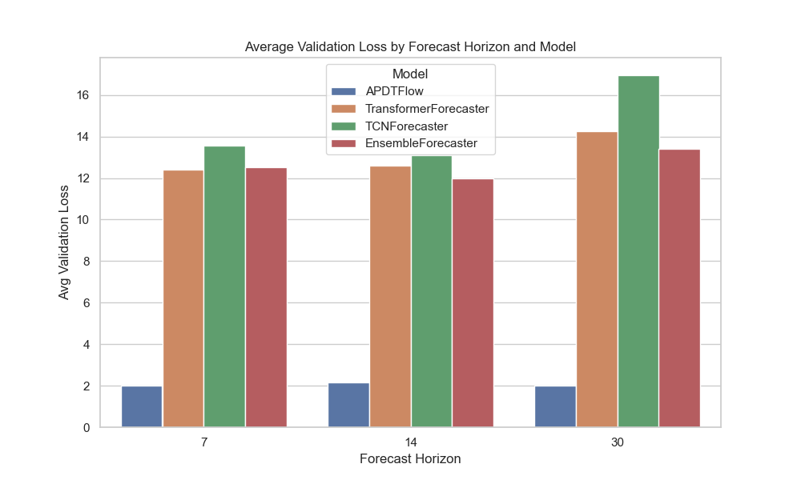

# Experiment Results and Analysis

In this document we present the results of our mega experiment, in which we compared multiple forecasting models available in APDTFlow using a 3‑fold rolling-window cross‑validation scheme over three forecast horizons (7, 10, and 30 time steps). The models evaluated include:

- **APDTFlow**
- **TransformerForecaster**
- **TCNForecaster**
- **EnsembleForecaster**

We collected evaluation metrics (average validation loss) and generated forecast plots on select cross‑validation splits. Below you will find several key visualizations along with our analysis.

---

## 1. Validation Loss Comparison

The bar plot below summarizes the average validation loss (mean squared error) for each model and forecast horizon.

**Discussion:**  
This plot shows that, overall, the APDTFlow model (and in some cases the ensemble) tends to achieve lower validation losses—especially as the forecast horizon increases—indicating that its multi‑scale decomposition and dynamic modeling capture the underlying trends and seasonality effectively.

---

## 2. Performance vs. Forecast Horizon

This line plot illustrates how the average validation loss of each model varies with the forecast horizon. This helps assess which models maintain robust performance as the forecast horizon increases.

**Discussion:**  
- The plot demonstrates that the performance of some models degrades with longer forecast horizons.  
- APDTFlow shows a relatively stable performance even as the horizon increases, which is critical for applications where long-term forecasting is required.
- The ensemble approach tends to moderate the extremes observed in individual models, offering more consistent results overall.

---

## 3. Example Forecast: Horizon 7, CV Split 3

Below is a sample forecast generated by the APDTFlow model for a forecast horizon of 7 time steps from the third cross‑validation split.

**Explanation:**  
- **Input Sequence (Blue):** The historical data (last 30 time steps) used as input.  
- **True Future (Dashed Orange):** The actual future values for the next 7 time steps.  
- **Predicted Future (Dotted Line):** The forecast produced by APDTFlow.  

This example shows how well the model is able to follow the trend of the actual data.

---

## 4. Summary of Experimental Setup

- **Dataset:** Daily minimum temperatures (cleaned CSV file).
- **Input Window (T_in):** 30 time steps.
- **Forecast Horizons (T_out):** 7, 10, and 30 time steps.
- **Cross-Validation:** Rolling-window CV with `train_size = 400`, `step_size = 50`, and 3 splits.
- **Training Hyper-parameters:**  
  - Epochs: 35  
  - Learning Rate: 0.0007  
  - Batch Size: 16

- **Model Configurations:**  
  - **APDTFlow:** `num_scales = 3`, `filter_size = 7`, `hidden_dim = 32`  
  - **TransformerForecaster:** `model_dim = 32`, `num_layers = 2`, `nhead = 4`  
  - **TCNForecaster:** `num_channels = [32, 32]`, `kernel_size = 7`

---

## 5. Full Experiment Notebook

For a complete view of our experimental setup, training routines, and detailed analysis (including additional plots and hyper-parameter tuning), please refer to our [Mega Experiment Notebook](https://github.com/yotambraun/APDTFlow/blob/main/experiments/notebooks/mega_experiment.ipynb).

---

## Conclusion

The experiment results demonstrate the strengths and trade-offs among the forecasting architectures in APDTFlow. In particular:

- **APDTFlow** excels in capturing seasonal trends and complex dynamics, especially at longer forecast horizons.
- **TransformerForecaster** and **TCNForecaster** offer competitive performance on shorter horizons but may struggle with longer-term dependencies.
- The **EnsembleForecaster** aggregates the strengths of the individual models and yields robust performance across different horizons.

For further details and additional plots, please consult the full documentation and experiment notebook provided in our repository.

Happy forecasting!

---

[Return to Project README](https://github.com/yotambraun/APDTFlow/tree/main)