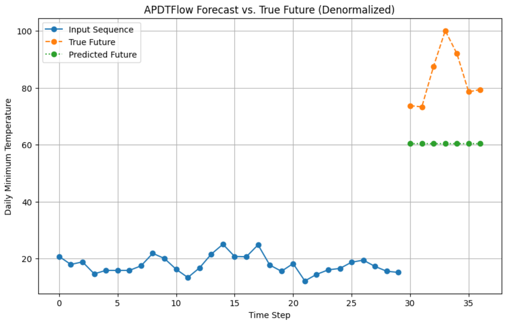

# APDTFlow Model Architectures

This document provides an in-depth look at the various forecasting models included in the APDTFlow framework. Each model is designed to address different aspects of time series forecasting and comes with unique architectural components and parameters. Understanding these details will help you choose and configure the best model for your specific application.

---

## Table of Contents

1. [APDTFlow Model](#apdtflow-model)
2. [TransformerForecaster](#transformerforecaster)
3. [TCNForecaster](#tcnforecaster)
4. [EnsembleForecaster](#ensembleforecaster)
5. [Parameter Summary](#parameter-summary)
6. [Conclusion](#conclusion)

---

## 1. APDTFlow Model

### Overview

The **APDTFlow** model is the flagship architecture in the framework. It integrates multiple advanced techniques to capture both global trends and local fluctuations in time series data while also providing uncertainty estimates.

*Figure 1: Forecast example comparing the input sequence, true future values, and the model’s predicted future.*
### Architecture Details

- **Multi-Scale Decomposition:**  
  The model decomposes the input time series into multiple scales (or resolutions). This enables the capture of both high-level trends and fine-grained details.
  
- **Hierarchical Neural Dynamics:**  
  Each decomposed scale is processed using a Neural Ordinary Differential Equation (Neural ODE) module. This module models the continuous evolution of latent states over time.
  
- **Probabilistic Fusion:**  
  Latent representations from the different scales are fused probabilistically. This not only merges information from various resolutions but also quantifies uncertainty in the forecasts.
  
- **Time-Aware Transformer Decoder:**  
  The fused latent state is passed to a Transformer-based decoder that integrates temporal information (using techniques like sine-cosine positional encodings) to generate the final forecast.

### Key Parameters

- **`T_in`:** Number of past time steps used as input.
- **`T_out`:** Forecast horizon (number of future time steps predicted).
- **`num_scales`:** Number of scales for multi-scale decomposition.
- **`filter_size`:** Size of the convolutional filter in the decomposition module (affects the receptive field).
- **`hidden_dim`:** Dimensionality of the hidden state in both the dynamics module and the decoder.
- **`forecast_horizon`:** Number of future steps to predict (should be equal to `T_out`).

### Use Cases

APDTFlow is best suited for complex forecasting tasks where:
- Multiple temporal patterns exist (e.g., seasonal, trend, and noise components).
- Quantifying forecast uncertainty is important (e.g., energy production, financial markets).
- Modeling both global and local dynamics is required.

---

## 2. TransformerForecaster

### Overview

The **TransformerForecaster** leverages the Transformer architecture, which is renowned for its self-attention mechanism. This model is especially useful for datasets with long-range dependencies and complex temporal interactions.

### Architecture Details

- **Encoder-Decoder Structure:**  
  Mimics the standard Transformer design with an encoder to process the input sequence and a decoder to generate forecasts.
  
- **Self-Attention Mechanism:**  
  Uses self-attention layers to weigh the importance of different time steps, allowing the model to capture long-term dependencies effectively.
  
- **Time-Aware Enhancements:**  
  Incorporates positional encodings and other mechanisms to preserve the sequential nature of the data.

### Key Parameters

- **`T_in` and `T_out`:** Define the input sequence length and forecast horizon.
- **`hidden_dim`:** Size of internal representations (affects the capacity of self-attention layers).
- **Attention-Specific Settings:**  
  While not always exposed in a simple API, parameters such as the number of attention heads and the number of Transformer layers can be tuned for performance and computational efficiency.

### Use Cases

TransformerForecaster is ideal when:
- Your time series data has long-range dependencies.
- You require a flexible architecture capable of learning complex patterns, such as in weather forecasting or stock market prediction.

---

## 3. TCNForecaster

### Overview

The **TCNForecaster** is based on Temporal Convolutional Networks (TCNs), which use dilated convolutions to efficiently capture long-range dependencies with a high degree of parallelism.

### Architecture Details

- **Dilated Convolutions:**  
  Utilizes dilated (or atrous) convolutions to increase the receptive field without a proportional increase in model parameters. This allows the network to consider a wide temporal context.
  
- **Residual Connections:**  
  Incorporates skip/residual connections to facilitate deeper network architectures and improve gradient flow during training.
  
- **Stacked Convolutional Layers:**  
  Features multiple convolutional layers that progressively extract higher-level features from the input sequence.

### Key Parameters

- **`T_in` and `T_out`:** Define the window of input data and forecast horizon.
- **`filter_size`:** Size of the convolutional filters; larger filters capture broader context.
- **`hidden_dim`:** Number of filters (channels) in the convolutional layers.
- **Dilation Rates:**  
  The configuration of dilation rates, which determines the effective receptive field of the network.

### Use Cases

TCNForecaster works well for:
- Real-time applications where parallel processing is advantageous.
- Scenarios where local dependencies are critical, such as short-term demand forecasting or sensor data analysis.

---

## 4. EnsembleForecaster

### Overview

The **EnsembleForecaster** is designed to combine the strengths of multiple forecasting models. By aggregating predictions from diverse architectures, ensemble methods often achieve more robust and accurate forecasts.

### Architecture Details

- **Model Aggregation:**  
  Multiple forecasters (e.g., APDTFlow, TransformerForecaster, TCNForecaster) are trained independently.
  
- **Fusion Strategies:**  
  The predictions from the individual models are combined using fusion strategies such as averaging or weighted averaging. In some implementations, probabilistic fusion is applied to also capture uncertainty.
  
- **Parallel Training:**  
  Individual models can be trained in parallel, and their outputs are aggregated during inference.

### Key Parameters

- **Consistent Input/Output Settings:**  
  All models within the ensemble must share the same `T_in` and `T_out` settings.
- **Fusion Method:**  
  The method used to aggregate forecasts, which may be configurable (e.g., simple average vs. weighted average).

### Use Cases

EnsembleForecaster is particularly beneficial when:
- You need to improve forecast accuracy and robustness.
- Your application can tolerate the extra computational cost of training and running multiple models (e.g., critical infrastructure forecasting).

---

## 5. Parameter Summary

| Parameter       | Description                                                                          | Typical Values               |
|-----------------|--------------------------------------------------------------------------------------|------------------------------|
| **`T_in`**      | Number of historical time steps used as input.                                       | Depends on the dataset       |
| **`T_out`**     | Forecast horizon; number of future time steps to predict.                            | Depends on the application   |
| **`num_scales`**| Number of scales for multi-scale decomposition (APDTFlow only).                       | 3–5 typically                |
| **`filter_size`**| Convolutional filter size in the decomposition or convolutional layers.             | 3–7 typically                |
| **`hidden_dim`**| Size of hidden states in dynamics modules or Transformer layers.                     | 16–128 (depending on complexity) |
| **`forecast_horizon`**| Must equal `T_out`, specifies the output length of the forecast.              | Same as T_out                |

---

## 6. Conclusion

The APDTFlow framework provides a suite of powerful forecasting models, each designed with different strengths:

- **APDTFlow Model:** Offers multi-scale decomposition with neural ODE dynamics and probabilistic fusion for uncertainty-aware forecasting.
- **TransformerForecaster:** Utilizes self-attention to capture long-range dependencies, ideal for complex temporal patterns.
- **TCNForecaster:** Employs dilated convolutions to efficiently model local and medium-range dependencies.
- **EnsembleForecaster:** Combines multiple models to deliver robust and accurate predictions through model aggregation.

By understanding the architectural details and tuning the key parameters, you can tailor these models to a wide range of time series forecasting tasks. For further information and usage examples, refer to the [Quick Start Guide](../README.md) and additional documentation within the repository.

Happy forecasting!
