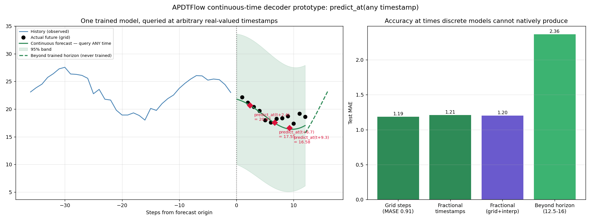

# APDTFlow Model Architectures

This document describes the model architectures shipped in APDTFlow v0.4.0: the main
APDTFlow model (with its two decoder variants), and the three alternative cores —
TransformerForecaster, TCNForecaster, and EnsembleForecaster.

For the literature each component builds on, the training objective, and how every
published number was produced, see [METHODOLOGY.md](METHODOLOGY.md) (canonical).
Measured results live in [experiment_results.md](experiment_results.md).

---

## Table of Contents

1. [The APDTFlow model](#1-the-apdtflow-model)
2. [ContinuousODEDecoder (`decoder_type='continuous'`)](#2-continuousodedecoder-decoder_typecontinuous)
3. [Multivariate input and sensor importance](#3-multivariate-input-and-sensor-importance)
4. [TransformerForecaster](#4-transformerforecaster)
5. [TCNForecaster](#5-tcnforecaster)
6. [EnsembleForecaster](#6-ensembleforecaster)
7. [Parameter summary](#7-parameter-summary)

---

## 1. The APDTFlow model

The core model treats the latent state of a time series as a continuous-time
trajectory governed by a learned ordinary differential equation. The pipeline, in
order:

### 1.1 Multi-scale decomposition

The input window is decomposed by parallel dilated convolutions
(`ResidualMultiScaleDecomposer`) into `num_scales` components at different temporal
resolutions. Each component is modeled separately and fused downstream, giving the
latent dynamics cleaner signals to integrate.

### 1.2 NeuralDynamics — the latent ODE

Each scale component conditions a latent state evolved by `NeuralDynamics`, a learned
ODE mapping `(t, (h, x_t))` to the time-derivatives of the latent mean and
log-variance. Integration uses `torchdiffeq`:

- `ode_method='rk4'` (default) — fixed-step RK4, roughly 10x faster on CPU;
- `ode_method='dopri5_adjoint'` — adaptive Dormand–Prince with adjoint
  backpropagation; lower memory for long sequences.

Treating the latent state as a continuous-time trajectory — rather than a discrete
recurrence — is what later enables `predict_at` and `predict_when`.

> Note: this class was named `HierarchicalNeuralDynamics` before v0.4.0. The old name
> remains as a deprecated alias for one minor release.

### 1.3 Additive time embedding (gated residual networks)

With `use_embedding=True` (the default), calendar/time-index information enters
through a learnable `TimeSeriesEmbedding` built from gated residual networks (in the
style of the Temporal Fusion Transformer), projected to one channel and **added to**
the series values:

```python
x = x + projected_embedding
```

The embedding is additive, never a substitute for the data. Versions ≤ 0.3.x replaced
the input with the embedding, which made predictions independent of the input series —
the defect, its discovery, and the regression tests that now prevent it are documented
in [METHODOLOGY.md, Section 8](METHODOLOGY.md#8-engineering-history).

### 1.4 Sequence-aware ProbScaleFusion

The per-scale latent trajectories — each kept at full length `(batch, T_in,
hidden_dim)`, not collapsed to a summary vector — are fused by uncertainty-weighted
attention computed **per timestep** (`ProbScaleFusion`). Scales that are confident at
a given time contribute more to the fused trajectory at that time.

### 1.5 Transformer decoder over the full latent trajectory

With `decoder_type='transformer'` (the default), a time-aware transformer decoder
attends over the **entire** fused latent trajectory (length `T_in`), not a single
final state, and emits the `forecast_horizon`-step forecast together with a
log-variance head.

### 1.6 Linear residual skip

A direct linear map from the raw input window to the forecast
(`nn.Linear(history_length, forecast_horizon)`) is added to the decoder output, in
the spirit of N-BEATS basis projections and the DLinear result that linear maps are a
strong forecasting backbone. The deep ODE-plus-transformer path learns the residual
the linear map cannot express. (The continuous decoder carries its own per-step skip,
so this one is transformer-only — applying both would double-count the skip and make
`predict()` disagree with `predict_at()` at integer offsets.)

### Training objective

Default loss is MSE (`loss_type='mse'`); Gaussian NLL is available
(`loss_type='nll'`). Under MSE training the log-variance head is untrained and its raw
values are meaningless — all uncertainty APDTFlow shows then comes from conformal
calibration, never from the variance head. See
[METHODOLOGY.md, Section 2](METHODOLOGY.md#2-training-objective).

---

## 2. ContinuousODEDecoder (`decoder_type='continuous'`)

New in v0.4.0. Construct the forecaster with `decoder_type='continuous'` to decode
forecasts at **arbitrary real-valued time offsets** — fractional steps, or beyond the
trained horizon. This decoder is what powers `predict_at(timestamps)` and
`predict_when(threshold)`.



How it works:

1. The encoder's final fused latent state `h_T` is integrated forward in **forecast
   time** by a second, small learned ODE (an MLP `dyn: (h, t) -> dh/dt`, fixed-step
   RK4 with step size 0.25, so integration accuracy does not depend on how sparse the
   query offsets are). A linear readout decodes each latent state; a parallel head
   emits log-variances.
2. **Per-step interpolated skip.** A linear map from the raw input window produces
   values at the integer grid offsets `1..forecast_horizon`; these are interpolated
   smoothly across continuous offsets with a Catmull–Rom cubic Hermite spline (linear
   extrapolation outside the grid). Without this skip the decoder collapses to
   level-only output on cyclic data — a failure we measured and now gate with a
   mandatory cycle-expressiveness test in `tests/test_continuous.py`.
3. **Randomized query training.** During `fit`, query times are sampled uniformly in
   `(0, horizon]` each batch and targets are linearly interpolated between grid
   points; the loss averages the grid loss and the off-grid loss. Off-grid accuracy is
   therefore trained, not emergent.

Offsets are expressed in forecast steps: `1.0` is one step after the end of the input
window; values beyond `forecast_horizon` extrapolate past the trained horizon (the
per-step conformal quantile of the last grid step is reused there — documented
behavior, not a calibration claim beyond the horizon). Measured grid/off-grid/
beyond-horizon behavior is reported in
[METHODOLOGY.md, Section 3](METHODOLOGY.md#3-continuous-time-decoding-predict_at) and
[experiment_results.md](experiment_results.md).

The model-level entry point is `APDTFlow.forward_at(x, t_span, query_offsets)`;
the user-facing APIs are `APDTFlowForecaster.predict_at`, `predict_when`, and
`predict_when_fleet`.

---

## 3. Multivariate input and sensor importance

New in v0.4.0. Pass `feature_cols` to `fit()` (with `model_type='apdtflow'`) to feed
multiple input series — e.g. raw sensor channels — alongside the target:

```python
model.fit(df, target_col='capacity', feature_cols=['voltage', 'temperature'])
```

Internally the model is built with `n_input_channels = 1 + len(feature_cols)` and a
learned **health-indicator fusion** layer (`nn.Conv1d(n_channels, 1, kernel_size=1)`)
fuses the channels into one series in front of the pipeline. The forecast target
remains `target_col`; each channel is independently z-normalized.

The fusion weights are a readable sensor-importance vector:

```python
model.sensor_importance_   # pd.Series indexed by channel name
```

`feature_cols` cannot be combined with `exog_cols` or `categorical_cols` (those enter
through a separate exogenous-fusion path; see the
[index page](index.md#exogenous-and-categorical-features)).

---

## 4. TransformerForecaster

A compact sequence-to-sequence transformer (`model_type='transformer'`): a linear
encoder lifts the input to `model_dim`, a standard `nn.TransformerDecoder` (2 layers,
4 heads) attends over the encoded sequence with fixed sine–cosine positional encodings
as the forecast queries, and a linear head emits the horizon. Useful as a strong,
familiar baseline for long-range dependencies. It does not support exogenous or
categorical features, conformal calibration through the forecaster, or
`predict_at`/`predict_when`.

## 5. TCNForecaster

A temporal convolutional network (`model_type='tcn'`): stacked causal dilated
convolutions with weight normalization, residual connections, and exponentially
growing dilation. Fast, parallel, and effective when local-to-medium-range structure
dominates. Same API limitations as the TransformerForecaster.

## 6. EnsembleForecaster

Combines multiple forecaster instances by (optionally weighted) averaging of their
predictions; members train independently. Available at the module level
(`apdtflow.models.ensemble_forecaster`) for custom pipelines.
`APDTFlowForecaster(model_type='ensemble')` is **not** currently supported in the
high-level API — use the module-level class directly.

---

## 7. Parameter summary

`APDTFlowForecaster` constructor parameters (the high-level API):

| Parameter | Default | Description |
|---|---|---|
| `model_type` | `'apdtflow'` | `'apdtflow'`, `'transformer'`, or `'tcn'` |
| `num_scales` | `3` | Scales in the multi-scale decomposition (APDTFlow only) |
| `hidden_dim` | `16` | Latent dimension of the ODE dynamics, fusion, and decoder |
| `filter_size` | `5` | Convolution filter size in the decomposer |
| `forecast_horizon` | `7` | Number of steps the model is trained to forecast |
| `history_length` | `30` | Input window length (also sizes the residual skip) |
| `learning_rate` | `0.001` | Adam learning rate |
| `batch_size` | `32` | Training batch size |
| `num_epochs` | `50` | Training epochs |
| `device` | auto | `'cuda'` or `'cpu'`; auto-detected if `None` |
| `use_embedding` | `True` | Additive learnable time embedding (Section 1.3) |
| `loss_type` | `'mse'` | `'mse'` or `'nll'` |
| `ode_method` | `'rk4'` | `'rk4'` or `'dopri5_adjoint'` (Section 1.2) |
| `decoder_type` | `'transformer'` | `'transformer'` or `'continuous'` (Section 2) |
| `exog_fusion_type` | `'gated'` | `'concat'`, `'gated'`, or `'attention'` |
| `use_conformal` | `False` | Calibrate conformal intervals during `fit` (required for `predict_when`) |
| `conformal_method` | `'split'` | `'split'` or `'adaptive'` |
| `calibration_split` | `0.2` | Fraction of data held for calibration |
| `early_stopping` | `False` | Stop on stalled validation loss |
| `patience` | `5` | Early-stopping patience (epochs) |
| `validation_split` | `0.2` | Validation fraction when early stopping is on |
| `categorical_encoding` | `'onehot'` | Encoding for `categorical_cols` |

Choosing a configuration:

- **Event timing / forecast at arbitrary times:** `decoder_type='continuous'`,
  `use_conformal=True`. This is the predictive-maintenance configuration.
- **Plain grid forecasting:** the defaults; add `use_conformal=True` for calibrated
  intervals.
- **Long input windows on limited memory:** `ode_method='dopri5_adjoint'`.
- **Multi-sensor equipment:** `fit(..., feature_cols=sensor_cols)`; inspect
  `sensor_importance_`. For equipment operating under multiple regimes, normalize
  per regime first with `apdtflow.preprocessing.regime_normalize`.

For when *not* to use APDTFlow at all (random-walk series, noise-driven event timing,
very short series), see [METHODOLOGY.md, Section 7](METHODOLOGY.md#7-negative-results--what-we-tested-and-do-not-ship).

---

[Back to documentation index](index.md)
